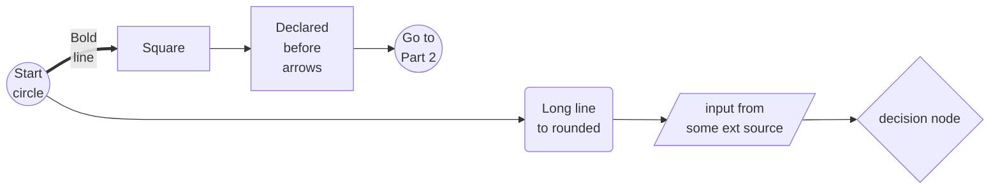
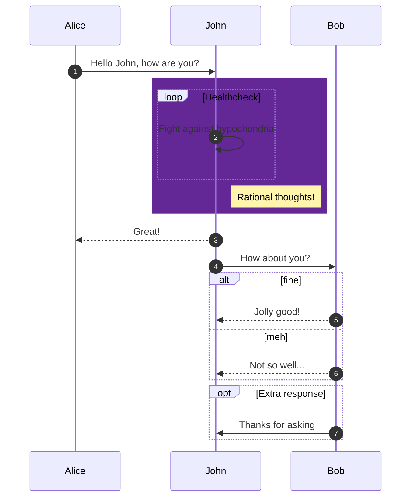
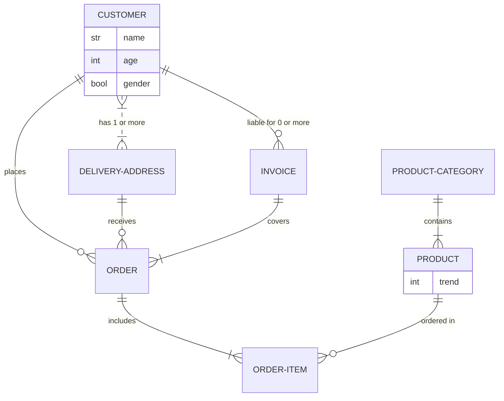

# A showcase of Mermaid

[Documentation](https://mermaid-js.github.io/mermaid/#/)

[Online editor](https://mermaid-js.github.io/mermaid-live-editor/)


### Flowchart



```mermaid
flowchart
    start((Patient comes \n to the clinic))
    exists{Registered \n patient}
    a1res{Family doctor \n appointment}
    start -->
    exists--No--> reg[Register] -->
    exists --Yes-->
    a1res --No issue--> finish1((Reassure and \n send home))
    a1res --Skin issue--> finish2(Dermathologist \n appointment)
    a1res -.Heart issue-->
    a2res{Surgeon \n appointment}

    subgraph SIRIUS BUSINESS
        a2res --Critical-->
        op((Operation!))
        a2res --Non-\ncritical--> pills((Pills))
    end
```

### Sequence diagram



### Entity relationship diagram

Value - Meaning

|o	o| -    Zero or one

||	|| -	Exactly one

}o	o{ -	Zero or more (no upper limit)

}|	|{ -	One or more (no upper limit)


